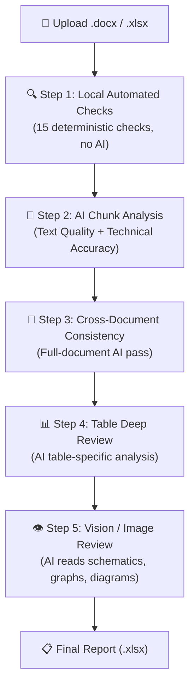

# TICO Document Review Tool — Complete Capabilities Guide

> Detailed breakdown of every check the tool performs, how it works internally, and real examples from the latest review of `ACC_Ph3_HardwareDesignDocument_WithAIChk.docx` (73 findings generated).

---

## Architecture Overview

The review tool runs a **6-step pipeline**. Steps 1 is fully deterministic (no AI). Steps 2–5 use an LLM. Step 6 uses a Vision LLM.

| Step | Engine | Speed | Consistency |
|------|--------|-------|-------------|
| Step 1 | Python regex + heuristics | ⚡ Instant | 100% identical every run |
| Step 2-4 | LLM (Ollama Cloud) | ⏳ Minutes | ~90% consistent |
| Step 5 | Vision LLM | ⏳ Minutes | ~85% consistent |

---

## 📊 Latest Report Statistics

| Metric | Value |
|--------|-------|
| **Total Findings** | 73 |
| **Critical** | 15 |
| **Major** | 45 |
| **Minor** | 13 |

| Category | Count | Source |
|----------|-------|--------|
| Grammar & Spelling | 26 | LLM + Local |
| Waveform Documentation | 19 | Vision LLM |
| TOC & Heading Structure | 18 | Local (deterministic) |
| Decimal Digit Consistency | 4 | Local (deterministic) |
| Formatting & Alignment | 3 | Local (deterministic) |
| Cross-Reference Accuracy | 1 | Local (deterministic) |
| Datasheet Copy Error | 1 | Local (deterministic) |
| Units & Calculations | 1 | Local (deterministic) |

---

# STEP 1: Local Automated Checks (15 Checks, No AI)

These run purely in Python — no LLM calls. They are **100% deterministic** and produce identical results every time for the same document.

---

### 1.1 Font Consistency Check

**What it does:** Scans every paragraph → every run (text segment). Compares each run's font name and size against the document's default font.

**How it works internally:**
- Reads the document's default font from `document.styles['Normal'].font`
- Iterates all sections → paragraphs → runs
- If any run uses a different font name → flags it
- If any body-text run uses a different font size (skips headings) → flags it

**Real example from report:**
> Finding #61: *"Font size inconsistency in body text. Default size is 12.0pt but the following sizes are also used: 10.0pt, 11.0pt."*

---

### 1.2 Decimal Digit Consistency

**What it does:** Checks if all numerical values within a single table column use the same number of decimal places. This is a very common issue in engineering tables.

**How it works internally:**
- Iterates each table → each column (skipping header row)
- Extracts numbers using regex: `r'^-?\d+\.\d+$'` and `r'(-?\d+\.\d+)\s*[a-zA-Z°Ω%]*'`
- Counts how many decimal places each number uses
- If a column has mixed decimal counts (e.g., some use 1 decimal, others use 2), it flags the minority as inconsistent

**Real examples from report:**
> Finding #16: *"Inconsistent decimal places in column 'two in parallel resistors'. Most values use 1 decimal places, but found: 2 decimal places."*

> Finding #18: *"Inconsistent decimal places in column 'Typ'. Most values use 1 decimal places, but found: 2 decimal places (9 values), 5 decimal places (1 value: 0.15625)."*

---

### 1.3 Cross-Reference Validation

**What it does:** Verifies that every "Figure X", "Table X", "Section X", "Equation X" reference in the body text actually exists in the document.

**How it works internally:**
- First pass: builds an index of all *actual* figures, tables, equations, and sections by scanning headings, table captions, and definition patterns like `"Figure 5: ..."` or `"Table 3 —"`
- Second pass: scans all body text with regex `r'(?:see\s+|refer\s+to\s+|in\s+|from\s+)?(Figure|Table|Equation|Section)\s+(\d+[-.]?\d*)'`
- If a reference doesn't match any indexed item → it's a broken reference

**Real example from report:**
> Finding #20: *"Broken reference: 'Figure 1' is referenced but does not appear to exist in this document."*

---

### 1.4 Table Duplication Detection

**What it does:** Detects tables that are exact or near-exact copies of each other (copy-paste errors from datasheets).

**How it works internally:**
- Computes an MD5 hash of the first 50 rows of each table
- Compares all table pairs:
  - If hashes match → exact duplicate (MAJOR)
  - If `SequenceMatcher.ratio() > 0.85` on first 500 chars → near-duplicate (MINOR)

---

### 1.5 Subscript/Superscript Error Detection

**What it does:** Detects broken formatting artifacts from copy-paste operations.

**How it works internally:**
- Scans all paragraph text for:
  - HTML tags in raw text: `r'</?(?:sub|sup|b|i|em|strong)>'` → broken subscript from copy-paste
  - Caret notation: `r'[A-Z]+\w*\^[\-\d\w]+'` → e.g., `VOUT^-0.879` should use proper superscript

---

### 1.6 Orphan Datasheet References

**What it does:** Detects references that were accidentally carried over from component datasheets via copy-paste.

**How it works internally:**
- Scans for patterns like:
  - `(Note 1)`, `(Note 3)` → datasheet footnotes that don't exist in this document
  - `Figure 9-4` → datasheet-style figure numbering (X-Y format) 

**Real example from report:**
> Finding #21: *"Orphan datasheet reference '(Note 2)' found. This note reference likely came from a component datasheet and does not exist in this document."*

---

### 1.7 TOC ↔ Heading Sync

**What it does:** Compares every entry in the Table of Contents against the actual headings in the document body. Catches stale TOC entries, renamed headings, and missing entries.

**How it works internally:**
- Extracts all TOC entries (text + number + level)
- Extracts all document headings (text + number + level)
- For each TOC entry:
  - Tries to match by section number first, then by normalized title
  - If number matches but title differs → stale TOC text
  - If title matches but number differs → numbering mismatch
  - If no match at all → orphan TOC entry
- Then checks reverse: headings present in document but missing from TOC

**Real examples from report (18 findings from this check alone!):**
> Finding #22: *"TOC entry 'Figure 1 TICO Specifications' does not match any heading in the document body."*

> Finding #38: *"Heading 'High level requirements' appears in the document but is missing from the TOC."*

> Findings #22–#37 are all stale TOC entries for figures/tables that were renamed or removed.

---

### 1.8 Section Number Continuity

**What it does:** Verifies section numbers are sequential. Catches gaps (1.1, 1.3 — missing 1.2) and duplicates (two sections numbered 2.2).

**How it works internally:**
- Parses all numbered heading strings into tuples: `"3.2.1" → (3, 2, 1)`
- Groups siblings by parent: `(3, 2, 1)` and `(3, 2, 2)` are siblings under `(3, 2)`
- Within each group: checks for gaps in the child sequence and flags duplicates

---

### 1.9 Heading Hierarchy Enforcement

**What it does:** Ensures no heading appears without its parent. For example, a Heading 3 should always have a Heading 2 above it.

**How it works internally:**
- Walks headings in document order
- Tracks "open headings" at each level
- If a Heading 3 appears but there's no Heading 2 currently open → orphan heading
- Also checks numbered hierarchy: if section `3.2.1` exists, section `3.2` must exist before it

---

### 1.10 Spacing Errors

**What it does:** Detects double spaces and excessive empty paragraphs.

**Real example from report:**
> Finding #62: *"Double spaces detected within the text. Use a single space after punctuation."*

> Finding #65: *"Multiple consecutive empty line breaks detected."*

---

### 1.11 Repeated Word Detection

**What it does:** Catches accidentally duplicated words like "the the" or "for for".

**Real example from report:**
> Finding #63: *"Repeated word detected: 'for for'."* (Fix Type: AUTO — can be auto-fixed)

---

### 1.12 Unmatched Brackets

**What it does:** Detects orphan parentheses, square brackets, and curly braces.

**Real example from report:**
> Finding #64: *"Unmatched parenthesis detected in text."*

---

### 1.13 Empty Paragraph Detection

**What it does:** Finds paragraphs that are completely empty (blank lines used as spacers instead of proper paragraph spacing).

---

### 1.14 Min/Typ/Max Table Validator

**What it does:** In engineering tables with Min/Typ/Max columns, checks that `Min ≤ Typ ≤ Max` for every row.

---

### 1.15 Engineering Unit Standardization

**What it does:** Flags values like `5V`, `3.3V`, `100mA` where the standard convention requires a space between the number and unit: `5 V`, `3.3 V`, `100 mA`.

**Real example from report:**
> Finding #66: *"Missing space before unit: '5V'. Standard convention is to have a space between the number and unit."*

---

# STEP 2: AI Chunk Analysis (LLM-Powered)

The document is split into chunks of ~5000 characters. Each chunk is sent to the LLM with a detailed prompt.

## What the LLM checks per chunk:

### 2.1 Spelling & Grammar
- Typos, misspellings, awkward sentence construction
- *Example: Finding #68 — "Typo: 'Cupper Button' should be 'Copper Button'"*

### 2.2 Terminology Consistency
- Same concept called different names across sections
- E.g., "Max Ratings" vs "Maximum Ratings" vs "Absolute Maximum Ratings"
- Or "VDD" vs "VCC" for the same power rail

### 2.3 Abbreviation Definitions
- Flags abbreviations/acronyms not defined on first use
- *Example: Finding #48 — "Table 9 uses 'SMT', 'LQFP-100', 'AEC-Q200' without defining them"*

### 2.4 Placeholder / Dummy Text Detection
- Catches nonsensical or template text left in the document
- *Example: Finding #1 (CRITICAL) — "Rows 5 through 9 contain repetitive placeholder text: 'It is a custom part from TICO 1500W' repeated across ALL columns"*

### 2.5 Technical Value Analysis
- Values without proper units
- Suspicious numerical values
- Missing explanations for calculations
- *Example: Finding #46 — Entire resistor divider calculation analyzed: "Output voltage is nearly constant (~0.98V) despite 55% input voltage increase (130V→200V). Values are suspiciously flat and may indicate calculation error."*

### 2.6 Date Format Consistency
- E.g., "13-Jun-2025" vs "10-Jul-25" in the same document

### 2.7 Incomplete Content
- Incomplete sentences or cut-off text
- *Example: Finding #72 — "'5V Regulat' is misspelled (should be 'Regulator')"*
- *Example: Finding #54 — "Text 'Debug and Prog' is cropped/cut off"*

---

# STEP 3: Cross-Document Consistency (Full-Document AI Pass)

A single LLM call that receives the **entire document summary** (up to 8000 chars). Checks:

- Cross-reference accuracy across the whole document
- Terminology consistency across ALL sections
- Expression consistency (e.g., "pins 8-18" in one place, "pins 8, 9, 10..." in another)
- Date format consistency document-wide
- Chapter naming pattern consistency
- Component coverage (components in text also in BOM/tables?)
- Logical flow (premise → calculation → conclusion)
- Placeholder / dummy text anywhere in the document

---

# STEP 4: Table Deep Review (AI)

A dedicated LLM pass focusing only on tables. Sends up to 15 tables (100 rows each) with a specialized prompt.

### What it checks:
1. Decimal place consistency within columns
2. Missing or unclear column headers
3. Empty cells that should have values
4. Inconsistent units across rows
5. Test results without pass/fail criteria
6. Numerical values without units
7. Suspicious outlier values
8. Missing table legends
9. Min/Typ/Max value ordering
10. Placeholder or dummy data

**Real examples from report:**
> Finding #40: *"Duplicate column headers: 'Items | Items | Items | (Target Spec.)'. The first three columns are all labeled 'Items'"*

> Finding #42: *"Row 1 has all three cells empty — represents a pending item with no description"*

> Finding #43: *"Inconsistent unit formatting: 'DC1000V' (no space) vs 'AC2500V 1min' (space). Also inconsistent hyphen spacing in 'DC input- USB output' vs 'DC input-GND'"*

> Finding #49: *"'HV custom connector' has empty 'Qty' cell — completely blank, not even 'TBD'"*

---

# STEP 5: Vision / Image Review (Vision LLM)

This is the most advanced capability. The tool sends each embedded image (schematic, graph, diagram) to a **Vision LLM** along with the surrounding document text. The AI performs two jobs:

### Job 1: Image Quality Check
- Missing labels, axis titles, unclear legends
- Unreadable text within diagrams
- Misspellings visible in images
- Formatting issues, cropped edges, low resolution
- Dummy/placeholder images

### Job 2: Image ↔ Text Cross-Checking (Most Powerful)
The AI compares what the image *shows* against what the document *text says*. This catches contradictions that NO text-only tool can find.

### Real Examples of Vision Analysis:

#### 🔴 Schematic Error Detection (Finding #5)
> *"Pin 5 (OUTAL) and Pin 6 (OUTAH) of the BM60213FV-CE2 gate driver are shorted together — electrically invalid, would cause shoot-through."*

The AI **read the schematic**, identified the IC, understood pin functions, and deduced the electrical consequence.

#### 🔴 Component Symbol Mismatch (Finding #3)
> *"Component D1009 has part number 'NRVTS30100MFST3G' (Schottky diode) but the schematic symbol is a 9-pin connector block."*

The AI cross-referenced the **component part number** against the **schematic symbol shape**.

#### 🔴 Text vs Image Contradiction (Finding #7)
> *"Text states '1500W Flyback Converter'. But efficiency graphs show max 5A @ 48V = only 240W."*

The AI **read the efficiency graph axes**, calculated power (V×I), and compared against the text claim.

#### 🔴 Voltage Rail Mismatch (Finding #2)
> *"Output rail labeled '5V' but capacitors rated '80uF/270V'. Resistor divider network (4×75kΩ) suggests ~300V rail, not 5V."*

The AI **read component values from the schematic** and performed engineering reasoning.

#### 🔴 Wrong Schematic for Section (Finding #10)
> *"Text describes 'ACC Phase 3 HV DCDC inverter' but image shows a completely different product — USB PD Controllers, Buck-Boost Controllers, 30A Buck Converter."*

The AI compared the **entire schematic context** against the **document's stated topic**.

#### 🔴 Missing Pin on Block Diagram (Finding #59)
> *"Pin 'BST1' is missing from the IC perimeter. The BST Charge block shows both BST1 and BST2, but only BST2 appears on the pin list."*

The AI verified **pin completeness** by comparing internal block outputs to perimeter pins.

#### 🟡 Formatting Issues in Schematics
> Finding #55: *"Unreadable text: 'Assembled com R1 R2 Inp No No 130' — looks like a placeholder or corrupted text"*

> Finding #69: *"Net label '16V' is red while others are black/purple — inconsistent color coding"*

> Finding #71: *"Capacitor value text '0.1uF/16V +_30%' overlaps resistor R1017 label"*

---

# STEP 6: Post-Processing

### Deduplication
- Compares every finding against all others using `SequenceMatcher`
- If two findings from the same category have >70% text similarity → keeps only one

### Severity Sorting
- Findings are sorted: CRITICAL first, then MAJOR, then MINOR

### Fix Type Classification
- `AUTO` — Simple text replacements (spelling corrections with clear fix)
- `MANUAL` — Everything else (schematic errors, structural issues, etc.)

### Numbering
- Each finding gets a sequential ID (1, 2, 3, ...)
- Status set to "OPEN" for all new findings

---

# Summary: 17 Category Types Supported

| # | Category | Icon | What It Catches |
|---|----------|------|-----------------|
| 1 | Grammar & Spelling | 📝 | Typos, grammar, sentence construction |
| 2 | Terminology Consistency | 📖 | Same thing called different names |
| 3 | Flowchart ↔ Description | 🔄 | Logic flow mismatches |
| 4 | Units & Calculations | 🔬 | Missing units, wrong math |
| 5 | Formatting & Alignment | 📐 | Font mix, spacing, margins |
| 6 | Signal & Variable Naming | 🏷️ | Pin/signal name inconsistencies |
| 7 | Test Result Completeness | ✅ | Missing pass/fail criteria |
| 8 | Waveform Documentation | 📈 | Image/schematic issues, graph problems |
| 9 | Cross-Reference Accuracy | 🔗 | Broken Figure/Table/Section references |
| 10 | Logical Consistency | 🧠 | Contradictory statements |
| 11 | Connector & Pin Mapping | 🔌 | Missing connector IDs |
| 12 | Measurement Resolution | 🔍 | Unreadable oscilloscope values |
| 13 | Decimal Digit Consistency | 🔢 | Mixed decimal places in table columns |
| 14 | Table Quality | 📊 | Duplicate tables, missing legends |
| 15 | Subscript/Superscript | ⬇️ | Broken formatting (`` tags, carets) |
| 16 | Datasheet Copy Error | 📋 | Orphan notes/figures from datasheets |
| 17 | TOC & Heading Structure | 📚 | Stale TOC, broken section numbering |
